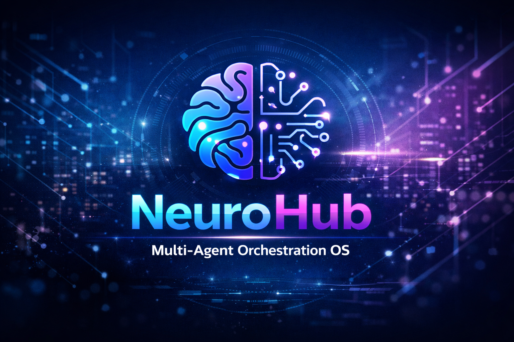

# NeuroHub | Multi-Agent Orchestration OS



NeuroHub is a real-time multi-agent orchestration platform designed to manage, monitor, and automate enterprise workflows, asset tracking, and secure CRUD operations.

---

## 🗂 Project Structure

```text

├── assets/
│   └── logo.png          
├── index.html            
├── style.css          
├── script.js            
└── README.md    

```

---

## ⚡ Features

- **Intelligence Hub** – Real-time monitoring of multi-agent activities.
- **Global Vault (CRUD)** – Secure storage of enterprise assets and contracts.
- **Agent Fleet** – Manage specialized AI agents (Legal, Finance, Risk).
- **Integrations** – Slack notifications, SMTP relay, and other workflows.
- **Core Settings** – API keys, orchestrator model configuration.
- **HITL (Human-in-the-Loop)** – Manual approval for high-value assets.
- **Dynamic Theming** – Light/Dark mode toggle.
- **Responsive Design** – Mobile-friendly layout.

---

## 🛠 Usage

1. Open `index.html` in a modern browser.
2. Use the sidebar to navigate between sections.
3. Add or update assets via **Manual Asset Update** or **Autonomous Document Ingestion**.
4. Monitor system logs in the **Orchestrator Communication Feed**.
5. Switch theme using the moon/sun icon on the top bar.
6. Search assets in the **Global Vault** using the search input.

---

## 💻 Development

- **HTML**: `index.html` – Main structure of the dashboard.
- **CSS**: `style.css` – Implements design system, theming, and responsiveness.
- **JavaScript**: `script.js` – Handles multi-agent orchestration, vault CRUD, HITL logic, and integrations.

---
## 🛠  Configuration
```

AIRIA API KEY – Set in Core Settings.

Slack Webhook URL – Configure in script.js for Slack notifications.

HITL Threshold – Adjust HITL_THRESHOLD in script.js for high-value assets.

```